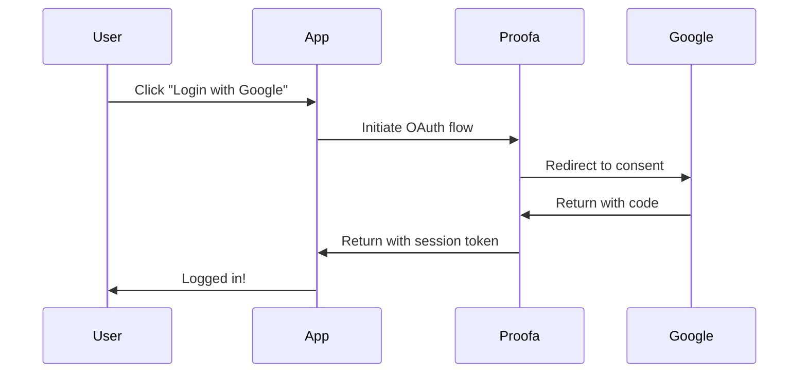

Proofa supports multiple authentication methods to fit your application's needs.

## Authentication Methods

| Method | Description | Best For |
|--------|-------------|----------|
| **OAuth** | Google, GitHub, etc. | Consumer apps, quick signup |
| **Magic Links** | Passwordless email links | Security-focused apps |

## Authentication Flow



## Basic Usage

```typescript
import { ProofaClient } from '@proofa/sdk';

const proofa = new ProofaClient({ appId: 'your-app' });

// OAuth login
await proofa.login({ provider: 'google' });

// Magic link
await proofa.sendMagicLink({ email: 'user@example.com' });

// Get current user
const user = await proofa.getUser();

// Logout
await proofa.logout();
```

## User Object

After authentication, you get a user object:

```typescript
interface User {
  id: string;
  email: string;
  name: string | null;
  avatar: string | null;
  provider: 'google' | 'github' | 'email';
  createdAt: Date;
  updatedAt: Date;
}
```

## Session Management

Sessions are automatically managed:

- **Access tokens** - Short-lived (15 min default)
- **Refresh tokens** - Long-lived (7 days default)
- **Rolling sessions** - Auto-extend on activity

See [Sessions](/sessions/overview/) for details.

## Next Steps

- [OAuth Providers](/authentication/oauth-providers/) - Configure providers
- [Magic Links](/authentication/magic-links/) - Passwordless auth
