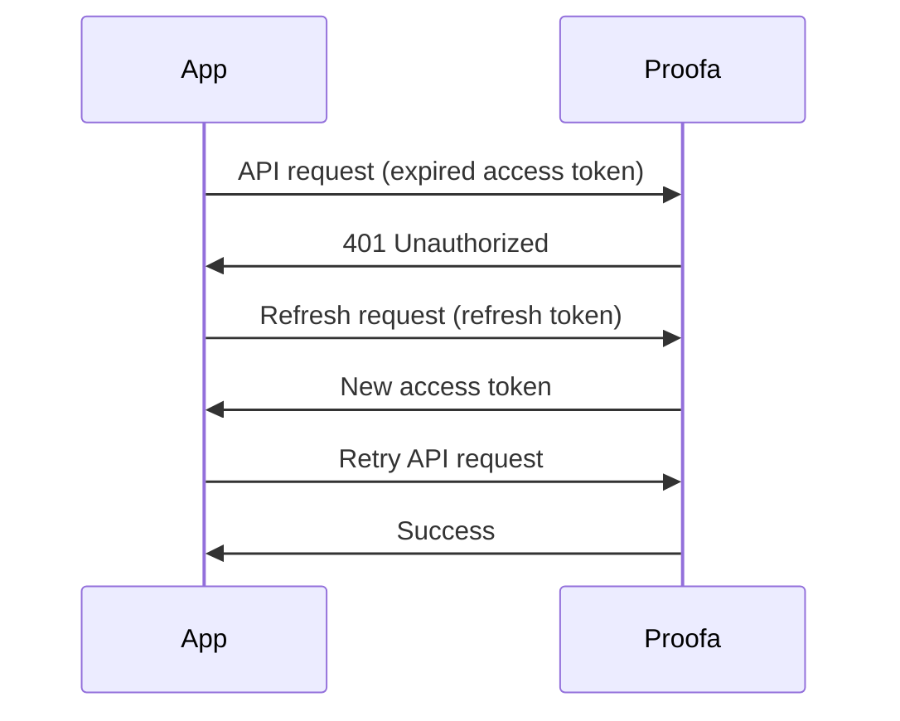

Proofa uses a dual-token system for secure, seamless authentication.

## Token Types

| Token | Lifetime | Purpose |
|-------|----------|---------|
| Access Token | 15 minutes | API authentication |
| Refresh Token | 7 days | Get new access tokens |

## Automatic Refresh

The SDK handles token refresh automatically:

```typescript
const proofa = new ProofaClient({ appId: 'your-app' });

// SDK automatically refreshes tokens before they expire
const user = await proofa.getUser(); // Always works if session is valid
```

## Manual Refresh

If needed, you can manually refresh tokens:

```typescript
// Check if access token is expired
if (proofa.isTokenExpired()) {
  await proofa.refreshToken();
}

// Force refresh
await proofa.refreshToken({ force: true });
```

## Refresh Flow



## Token Rotation

For enhanced security, refresh tokens rotate on use:

1. Client uses refresh token to get new access token
2. Server issues new access token AND new refresh token
3. Old refresh token is invalidated

This limits the window if a refresh token is compromised.

## Configuration

```bash
# Access token lifetime (seconds)
ACCESS_TOKEN_TTL=900  # 15 minutes

# Refresh token lifetime (seconds)
REFRESH_TOKEN_TTL=604800  # 7 days

# Enable refresh token rotation
REFRESH_TOKEN_ROTATION=true
```

## Error Handling

```typescript
try {
  await proofa.refreshToken();
} catch (error) {
  if (error.code === 'REFRESH_TOKEN_EXPIRED') {
    // User needs to re-authenticate
    await proofa.login({ provider: 'google' });
  } else if (error.code === 'REFRESH_TOKEN_REVOKED') {
    // Session was revoked (e.g., logout from another device)
    redirect('/login?reason=session_revoked');
  }
}
```

## Best Practices

1. **Let the SDK handle it** - Automatic refresh is reliable
2. **Handle auth errors** - Redirect to login on session expiration
3. **Use short access tokens** - 15 minutes is a good balance
4. **Enable rotation** - Extra security with minimal overhead
