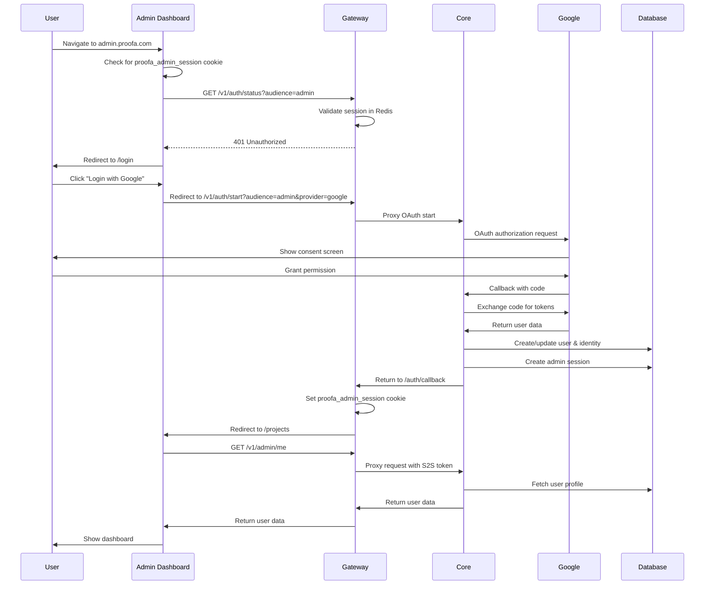

# Proofa Dashboards - Complete Implementation Guide

**Last Updated**: January 11, 2026  
**Status**: Production Ready  
**Version**: 1.0

---

## Table of Contents

1. [Overview](#overview)
2. [Admin Dashboard](#admin-dashboard)
3. [User Dashboard](#user-dashboard)
4. [Architecture](#architecture)
5. [Authentication Flow](#authentication-flow)
6. [API Integration](#api-integration)
7. [Deployment](#deployment)
8. [Development Guide](#development-guide)

---

## Overview

Proofa provides two separate dashboards:

| Dashboard | URL | Audience | Purpose |
|-----------|-----|----------|---------|
| **Admin Dashboard** | `admin.proofa.com` | Project owners, team members | Manage projects, apps, licenses, billing |
| **User Dashboard** | `account.proofa.com` | End users | View profile, manage sessions |

### Technology Stack

- **Framework**: React 18+ with TypeScript
- **Build Tool**: Vite
- **Routing**: React Router v6
- **State Management**: TanStack Query (React Query)
- **HTTP Client**: `pingpong` from `@proofa/auth`
- **Styling**: Custom CSS with CSS variables
- **Icons**: Inline SVG

---

## Admin Dashboard

### Purpose

The Admin Dashboard allows project owners and team members to:
- Create and manage projects
- Configure apps (OAuth, payment, licensing)
- View users and licenses
- Monitor webhooks and transactions
- Export billing data
- Process refunds

### Features

#### 1. Project Management

**Projects List** (`/projects`)
- View all projects user has access to
- Create new project
- Project cards show:
  - Project name and description
  - Number of apps
  - Team member count
  - Creation date

**Project Detail** (`/projects/:projectId`)
- Overview statistics:
  - Total users across all apps
  - Total active licenses
  - Monthly revenue
  - App count
- Quick actions:
  - Create new app
  - Invite team member
  - Configure payment providers

**Project Statistics** (`/projects/:projectId/stats`)
- User growth over time
- License distribution (free, trial, pro, etc.)
- Revenue trends
- App usage metrics

**Project Settings** (`/projects/:projectId/settings`)
- Edit project name and description
- Update slug (URL identifier)
- Archive/delete project
- Danger zone actions

#### 2. Team Management

**Project Team** (`/projects/:projectId/team`)
- List all team members with roles:
  - Owner (full access)
  - Admin (manage apps, licenses)
  - Member (view only)
- Invite new members by email
- Update member roles
- Remove team members

**Permissions**:
- Only owners can delete projects
- Admins can manage apps and licenses
- Members have read-only access

#### 3. App Management

**Apps List** (`/projects/:projectId/apps`)
- View all apps in project
- Create new app
- App cards show:
  - App name and slug
  - Active/inactive status
  - User count
  - License summary

**App Dashboard** (`/projects/:projectId/apps/:appId`)
- Key metrics:
  - Total users
  - Active licenses by plan
  - Monthly recurring revenue
  - Session count
- Recent activity feed
- Quick links to:
  - User management
  - License configuration
  - API keys

**App Users** (`/projects/:projectId/apps/:appId/users`)
- Paginated user list
- Search by email/name
- Filter by license status
- User details:
  - Name, email
  - License plan
  - Registration date
  - Last login
- Bulk actions:
  - Grant licenses
  - Send notifications

**App Licenses & Plans** (`/projects/:projectId/apps/:appId/licenses`)
- **Plans Tab**:
  - Create new plan
  - Edit existing plans (name, price, features)
  - Set trial periods
  - Archive old plans
- **Licenses Tab**:
  - View all licenses
  - Grant manual licenses
  - Revoke licenses
  - Filter by plan/status

**Plan Configuration**:
```json
{
  "name": "Pro",
  "slug": "pro",
  "description": "For professional users",
  "price_monthly": 999,  // cents
  "price_yearly": 9999,   // cents
  "trial_days": 14,
  "features": [
    "Unlimited bookmarks",
    "AI-powered tagging",
    "Priority support"
  ]
}
```

#### 4. OAuth Configuration

**App OAuth Settings** (`/projects/:projectId/apps/:appId/oauth`)
- Enable/disable providers:
  - Google
  - GitHub
  - (More providers coming soon)
- Configure per provider:
  - Client ID
  - Client Secret (encrypted)
  - Scopes
  - Redirect URIs
- Test OAuth flow
- View OAuth logs

**Security Settings**:
- Allowed redirect URIs (whitelist)
- Allowed origins (CORS)
- Session TTL (1-365 days)
- Max concurrent sessions

#### 5. Payment Integration

**Project Payment Providers** (`/projects/:projectId/payment-providers`)
- Configure payment providers:
  - Stripe
  - LemonSqueezy
  - (More providers coming soon)
- Test/Production environments
- Webhook configuration
- Provider credentials (encrypted)

**App Payment Settings** (`/projects/:projectId/apps/:appId/payment`)
- Select payment provider for app
- Configure checkout settings:
  - Success URL
  - Cancel URL
  - Custom branding
- Payment routing rules
- Test payment flow

**Billing Dashboard** (`/billing`)
- Global billing overview across all projects
- Revenue charts
- Transaction history
- Upcoming renewals
- Failed payments

#### 6. API Keys

**App API Keys** (`/projects/:projectId/apps/:appId/api-keys`)
- Generate API keys for backend integration
- View current key (masked)
- Rotate keys with grace period
- Revoke keys immediately
- Key usage logs

**Key Format**: 
```
proofa_sk_live_abc123xyz...  (64 chars)
proofa_sk_test_abc123xyz...  (for testing)
```

#### 7. Integration Guide

**App Developers** (`/projects/:projectId/apps/:appId/developers`)
- Quick start guide
- Code snippets for:
  - Login redirect
  - Callback handling
  - Session verification
- SDK links:
  - `@proofa/client` (JavaScript/TypeScript)
  - Browser extension integration
- API documentation links
- Webhook setup

#### 8. Monitoring & Analytics

**Webhook Monitoring** (`/webhooks`)
- View all webhook events across projects
- Filter by:
  - Provider (Stripe, LemonSqueezy)
  - Event type
  - Status (success, failed)
  - Date range
- Retry failed webhooks
- View request/response payloads
- Webhook logs

**Transaction Export** (`/export`)
- Export transactions to CSV
- Date range selector
- Filter by:
  - Project
  - App
  - Payment provider
  - Transaction type
- Column customization
- Scheduled exports (coming soon)

**Refund Processing** (`/refunds`)
- View refund requests
- Process refunds:
  - Full refund
  - Partial refund
  - Custom amount
- Update license status
- Refund history
- Bulk refund processing

#### 9. User Profile

**Profile** (`/profile`)
- View admin profile
- Update name
- Change avatar
- Connected identities (Google, GitHub)
- Account security
- Logout

### Page Structure

#### Sidebar Navigation

The sidebar adapts to three contexts:

**Context 1: Global View** (at `/projects` or `/billing`):
```
📁 Projects
💳 Billing
🪝 Webhooks
↩️  Refunds
📥 Export
📚 Documentation
```

**Context 2: Project View** (at `/projects/:projectId`):
```
📊 Project
  └─ Overview
  └─ Statistics

⚙️  Management
  └─ Apps
  └─ Team
  └─ Payment Providers
  └─ Settings
```

**Context 3: App View** (at `/projects/:projectId/apps/:appId`):
```
📱 App
  └─ Dashboard
  └─ Users
  └─ Licenses & Plans
  └─ API Keys
  └─ OAuth Config
  └─ Payment Config
  └─ Integration Guide
  └─ App Settings
```

#### Top Header

```
┌─────────────────────────────────────────────────────┐
│ [Proofa Logo] [Beta]     [Theme] [Docs] [Profile] │
└─────────────────────────────────────────────────────┘
```

- **Project Dropdown**: Switch between projects
- **Theme Toggle**: Light/Dark/System
- **Documentation**: Opens docs.proofa.com
- **Profile**: User avatar and name

### Authentication

#### Login Flow

1. User navigates to `admin.proofa.com`
2. Redirected to `/login` if not authenticated
3. Login page shows OAuth options (Google, GitHub)
4. User clicks provider button
5. Redirects to Gateway: `api.proofa.sh/v1/auth/start?audience=admin`
6. Gateway proxies to Core OAuth flow
7. After authentication, redirects back to admin dashboard
8. Admin session cookie set: `proofa_admin_session`
9. Session TTL: 2 hours absolute + 15 minutes inactivity

#### Session Management

- **Cookie Name**: `proofa_admin_session`
- **HttpOnly**: Yes
- **Secure**: Yes (production)
- **SameSite**: Lax
- **TTL**: 2 hours from creation OR 15 minutes of inactivity (whichever comes first)
- **Storage**: Gateway Redis
- **Refresh**: No (strict admin security)

#### Authorization

Admin endpoints check:
1. Valid session cookie
2. User exists in database
3. User has `is_admin` flag OR is project owner/team member
4. Project/app access based on team membership

### API Integration

All API calls go through Gateway (`api.proofa.sh`), which proxies to Core with S2S authentication.

#### Request Pattern

```typescript
import { pingpong } from '@proofa/auth';

const gatewayUrl = 'https://api.proofa.sh';

// GET request
const response = await pingpong(`${gatewayUrl}/v1/admin/projects`, {
  credentials: 'include', // Critical: sends session cookie
});

if (response.ok()) {
  const data = response.data; // Auto-parsed JSON
  console.log(data.projects);
}

// POST request
const response = await pingpong(`${gatewayUrl}/v1/admin/projects`, {
  method: 'POST',
  body: { name: 'My Project', slug: 'my-project' },
  credentials: 'include',
});
```

#### Error Handling

```typescript
if (response.status === 401) {
  // Redirect to login
  window.location.href = '/login';
} else if (response.status === 403) {
  // Show permission error
  alert('You do not have permission to perform this action');
} else if (response.isError()) {
  // Show generic error
  alert(response.data.message || 'Something went wrong');
}
```

### State Management

Uses TanStack Query for server state:

```typescript
// Fetch projects
const { data: projects, isLoading, error } = useProjects();

// Create project
const { mutate: createProject, isPending } = useCreateProject();

createProject({
  name: 'My Project',
  slug: 'my-project'
}, {
  onSuccess: () => {
    // Refetch projects
    queryClient.invalidateQueries({ queryKey: ['projects'] });
  }
});
```

### Theming

Supports three themes:
- **Light**: Default
- **Dark**: High contrast
- **System**: Follows OS preference

Themes use CSS variables:

```css
:root {
  --bg-primary: #ffffff;
  --text-primary: #1a1a1a;
  --primary: #8b5cf6;
  /* ... */
}

[data-theme="dark"] {
  --bg-primary: #1a1a1a;
  --text-primary: #ffffff;
  /* ... */
}
```

Toggle theme with button in header. Preference stored in `localStorage`.

---

## User Dashboard

### Purpose

The User Dashboard allows end users to:
- View and update their profile
- Manage active sessions
- See connected identities
- Logout from all devices

### Features

#### 1. Profile Management

**Profile Page** (`/profile`)
- View user information:
  - Name
  - Email (verified status)
  - Avatar
  - Member since date
- Update profile:
  - Change name
  - Update avatar URL
- Connected identities:
  - Google (email, linked date)
  - GitHub (username, linked date)
- Link new identity

#### 2. Session Management

**Sessions Page** (`/sessions`)
- View all active sessions:
  - Device/browser info
  - IP address
  - Location (approximate)
  - Last activity
  - Created date
- Logout individual sessions
- Logout all other sessions
- Current session highlighted

**Session Security**:
- Shows suspicious activity
- Geographic anomalies
- New device alerts
- Concurrent session limits (per app)

### Page Structure

#### Top Header

```
┌──────────────────────────────────────────────┐
│ [Logo] Profile | Sessions  [Theme] [User] │
└──────────────────────────────────────────────┘
```

Simple, focused navigation:
- Profile
- Sessions
- Theme toggle
- User menu

### Authentication

#### Login Flow

1. User navigates to `account.proofa.com`
2. Redirected to `/login` if not authenticated
3. Login page shows OAuth options
4. User clicks provider button
5. Redirects to Gateway: `api.proofa.sh/v1/auth/start?audience=user`
6. Gateway proxies to Core OAuth flow
7. After authentication, redirects back to user dashboard
8. User session cookie set: `proofa_user_session`
9. Session TTL: 365 days rolling

#### Session Management

- **Cookie Name**: `proofa_user_session`
- **HttpOnly**: Yes
- **Secure**: Yes (production)
- **SameSite**: Lax
- **TTL**: 365 days rolling (refreshes on activity)
- **Storage**: Core database + Gateway Redis
- **Refresh**: Automatic (if last activity > 30 days ago)

### API Integration

Uses Gateway endpoints:

```typescript
import { pingpong } from '@proofa/auth';

const gatewayUrl = 'https://api.proofa.sh';

// Get current user
const response = await pingpong(`${gatewayUrl}/v1/me`, {
  credentials: 'include',
});

const { user, license } = response.data;

// Update profile
const response = await pingpong(`${gatewayUrl}/v1/me`, {
  method: 'PATCH',
  body: { name: 'New Name' },
  credentials: 'include',
});

// List sessions
const response = await pingpong(`${gatewayUrl}/v1/sessions`, {
  credentials: 'include',
});

const { sessions } = response.data;

// Logout all sessions
const response = await pingpong(`${gatewayUrl}/v1/sessions`, {
  method: 'DELETE',
  credentials: 'include',
});
```

### Minimal Scope

The User Dashboard intentionally has a **minimal scope**:
- ✅ Profile management
- ✅ Session management
- ❌ No project creation
- ❌ No app management
- ❌ No license purchasing (handled by app integration)
- ❌ No billing (managed by apps/projects)

**Rationale**: End users interact with Proofa through their apps. The User Dashboard is for account management only.

---

## Architecture

### Service Communication

```
User Browser
    ↓ (HTTPS)
┌──────────────────────────────────────┐
│     Dashboard (Static Site)          │
│  admin.proofa.com / account.proofa.com│
└──────────────────────────────────────┘
    ↓ (API calls with cookie)
┌──────────────────────────────────────┐
│       Gateway (api.proofa.sh)        │
│  - Session validation                │
│  - Rate limiting                     │
│  - Request proxying                  │
└──────────────────────────────────────┘
    ↓ (S2S with X-S2S-Token)
┌──────────────────────────────────────┐
│       Core (auth.proofa.com)         │
│  - Database operations               │
│  - Business logic                    │
│  - OAuth handling                    │
└──────────────────────────────────────┘
```

### Data Flow

1. **Dashboard makes API call** with session cookie
2. **Gateway validates session** in Redis
3. **Gateway proxies to Core** with:
   - `X-S2S-Token`: Service authentication
   - `X-User-Id`: User's public ID
   - `X-Session-Id`: Session ID
4. **Core processes request** and returns data
5. **Gateway forwards response** to dashboard
6. **Dashboard updates UI** with data

### Security Layers

1. **TLS/HTTPS**: All communication encrypted
2. **HttpOnly cookies**: Prevent XSS
3. **SameSite=Lax**: Prevent CSRF
4. **S2S Token**: Authenticate Gateway → Core
5. **Session validation**: Check Redis cache
6. **Database lookups**: Verify user permissions
7. **Rate limiting**: Prevent abuse
8. **CORS**: Restrict origins

---

## Authentication Flow

### Admin Login (Detailed)



### User Login (Detailed)

Similar flow but:
- Cookie: `proofa_user_session`
- Audience: `user`
- TTL: 365 days rolling
- Endpoints: `/v1/me`, `/v1/sessions`

---

## API Integration

### Admin API Endpoints

#### Projects

```typescript
// List projects
GET /v1/admin/projects
Response: { projects: Project[] }

// Create project
POST /v1/admin/projects
Body: { name: string; slug: string; description?: string }
Response: Project

// Get project
GET /v1/admin/projects/:projectId
Response: Project

// Update project
PATCH /v1/admin/projects/:projectId
Body: { name?: string; description?: string }
Response: Project

// Delete project
DELETE /v1/admin/projects/:projectId
Response: { ok: true }

// Get project stats
GET /v1/admin/projects/:projectId/stats
Response: { users: number; licenses: number; revenue: number; apps: number }
```

#### Apps

```typescript
// List apps
GET /v1/admin/projects/:projectId/apps
Response: { apps: App[] }

// Create app
POST /v1/admin/projects/:projectId/apps
Body: { name: string; slug: string; /* ... */ }
Response: App

// Get app
GET /v1/admin/apps/:appId
Response: App

// Update app
PATCH /v1/admin/apps/:appId
Body: { name?: string; /* ... */ }
Response: App

// Delete app
DELETE /v1/admin/apps/:appId
Response: { ok: true }
```

#### Users

```typescript
// List app users
GET /v1/admin/apps/:appId/users?page=1&limit=50
Response: { users: User[]; total: number; page: number }

// Get user
GET /v1/admin/users/:userId
Response: User

// Search users
GET /v1/admin/apps/:appId/users/search?q=email@example.com
Response: { users: User[] }
```

#### Licenses

```typescript
// List licenses
GET /v1/admin/apps/:appId/licenses?page=1&limit=50
Response: { licenses: License[]; total: number }

// Grant license
POST /v1/admin/apps/:appId/licenses
Body: { userId: string; planId: string; duration?: number }
Response: License

// Revoke license
DELETE /v1/admin/licenses/:licenseId
Response: { ok: true }

// Update license
PATCH /v1/admin/licenses/:licenseId
Body: { status?: string; valid_until?: number }
Response: License
```

#### Plans

```typescript
// List plans
GET /v1/admin/apps/:appId/plans
Response: { plans: Plan[] }

// Create plan
POST /v1/admin/apps/:appId/plans
Body: Plan
Response: Plan

// Update plan
PATCH /v1/admin/plans/:planId
Body: Partial<Plan>
Response: Plan

// Delete plan (soft delete)
DELETE /v1/admin/plans/:planId
Response: { ok: true }
```

#### OAuth

```typescript
// Get OAuth config
GET /v1/admin/apps/:appId/oauth
Response: OAuthConfig

// Update OAuth config
PATCH /v1/admin/apps/:appId/oauth
Body: { provider: string; enabled: boolean; clientId?: string; clientSecret?: string }
Response: OAuthConfig
```

#### Payment

```typescript
// Get payment config
GET /v1/admin/apps/:appId/payment
Response: PaymentConfig

// Update payment config
PATCH /v1/admin/apps/:appId/payment
Body: { providerId: string; /* ... */ }
Response: PaymentConfig

// List payment providers
GET /v1/admin/projects/:projectId/payment-providers
Response: { providers: PaymentProvider[] }

// Create payment provider
POST /v1/admin/projects/:projectId/payment-providers
Body: { provider: string; environment: string; credentials: object }
Response: PaymentProvider
```

#### Webhooks

```typescript
// List webhooks
GET /v1/admin/webhooks?page=1&limit=50&status=failed
Response: { webhooks: Webhook[]; total: number }

// Get webhook
GET /v1/admin/webhooks/:webhookId
Response: Webhook

// Retry webhook
POST /v1/admin/webhooks/:webhookId/retry
Response: { ok: true }
```

#### Transactions

```typescript
// Export transactions
POST /v1/admin/transactions/export
Body: { startDate: string; endDate: string; projectId?: string }
Response: { url: string } // CSV download URL
```

#### Refunds

```typescript
// List refunds
GET /v1/admin/refunds?page=1&limit=50
Response: { refunds: Refund[]; total: number }

// Process refund
POST /v1/admin/refunds
Body: { transactionId: string; amount: number; reason: string }
Response: Refund
```

### User API Endpoints

```typescript
// Get current user
GET /v1/me
Response: { user: User; license?: License }

// Update profile
PATCH /v1/me
Body: { name?: string; avatar_url?: string }
Response: User

// List sessions
GET /v1/sessions
Response: { sessions: Session[] }

// Delete session
DELETE /v1/sessions/:sessionId
Response: { ok: true }

// Logout all sessions
DELETE /v1/sessions
Response: { ok: true }
```

---

## Deployment

### Build Configuration

#### Admin Dashboard

```bash
# Install dependencies
pnpm install

# Build for production
pnpm --filter=@proofa/admin build

# Output: apps/dashboard/admin/dist/
```

**Environment Variables**:
```env
VITE_GATEWAY_URL=https://api.proofa.sh
VITE_DOCS_URL=https://docs.proofa.com
```

#### User Dashboard

```bash
# Build for production
pnpm --filter=@proofa/user build

# Output: apps/dashboard/user/dist/
```

**Environment Variables**:
```env
VITE_GATEWAY_URL=https://api.proofa.sh
```

### Hosting Options

#### Option 1: Vercel (Recommended)

```bash
# Deploy admin dashboard
vercel --cwd apps/dashboard/admin

# Deploy user dashboard
vercel --cwd apps/dashboard/user
```

**Vercel Configuration** (`vercel.json`):
```json
{
  "buildCommand": "pnpm build",
  "outputDirectory": "dist",
  "framework": "vite",
  "rewrites": [
    { "source": "/(.*)", "destination": "/index.html" }
  ],
  "headers": [
    {
      "source": "/(.*)",
      "headers": [
        {
          "key": "X-Frame-Options",
          "value": "DENY"
        },
        {
          "key": "X-Content-Type-Options",
          "value": "nosniff"
        },
        {
          "key": "Referrer-Policy",
          "value": "strict-origin-when-cross-origin"
        }
      ]
    }
  ]
}
```

#### Option 2: Netlify

```bash
# Deploy
netlify deploy --prod --dir=dist
```

**Netlify Configuration** (`netlify.toml`):
```toml
[build]
  command = "pnpm build"
  publish = "dist"

[[redirects]]
  from = "/*"
  to = "/index.html"
  status = 200

[[headers]]
  for = "/*"
  [headers.values]
    X-Frame-Options = "DENY"
    X-Content-Type-Options = "nosniff"
    Referrer-Policy = "strict-origin-when-cross-origin"
```

#### Option 3: Cloudflare Pages

```bash
# Deploy
wrangler pages deploy dist --project-name=proofa-admin
```

#### Option 4: Self-Hosted (Nginx)

```nginx
server {
    listen 443 ssl http2;
    server_name admin.proofa.com;

    root /var/www/proofa-admin;
    index index.html;

    location / {
        try_files $uri $uri/ /index.html;
    }

    # Security headers
    add_header X-Frame-Options "DENY" always;
    add_header X-Content-Type-Options "nosniff" always;
    add_header Referrer-Policy "strict-origin-when-cross-origin" always;

    # SSL configuration
    ssl_certificate /path/to/fullchain.pem;
    ssl_certificate_key /path/to/privkey.pem;
}
```

### DNS Configuration

```
admin.proofa.com    CNAME    cname.vercel-dns.com
account.proofa.com  CNAME    cname.vercel-dns.com
```

Or:
```
admin.proofa.com    A    76.76.21.21  (Vercel IP)
account.proofa.com  A    76.76.21.21
```

### SSL/TLS

Use Let's Encrypt or your hosting provider's SSL:
- Vercel: Automatic SSL
- Netlify: Automatic SSL
- Cloudflare: Automatic SSL
- Self-hosted: Certbot

---

## Development Guide

### Setup

```bash
# Clone repository
git clone https://github.com/0xdps/proofa-core.git
cd proofa-core

# Install dependencies
pnpm install

# Start admin dashboard
pnpm --filter=@proofa/admin dev

# Start user dashboard
pnpm --filter=@proofa/user dev
```

### Environment Variables

Create `.env` files:

**Admin Dashboard** (`apps/dashboard/admin/.env`):
```env
VITE_GATEWAY_URL=http://localhost:3004
VITE_DOCS_URL=http://localhost:4000
```

**User Dashboard** (`apps/dashboard/user/.env`):
```env
VITE_GATEWAY_URL=http://localhost:3004
```

### Development URLs

- Admin Dashboard: http://localhost:5173
- User Dashboard: http://localhost:5174
- Gateway: http://localhost:3004
- Core: http://localhost:3003

### Code Structure

```
apps/dashboard/admin/
├── src/
│   ├── components/          # Reusable UI components
│   │   ├── Toast.tsx       # Toast notifications
│   │   └── ...
│   ├── hooks/              # Custom React hooks
│   │   ├── api.ts          # API query hooks
│   │   └── useAuth.ts      # Authentication hook
│   ├── lib/                # Utilities
│   │   └── pingpong.ts     # HTTP client
│   ├── pages/              # Page components
│   │   ├── Projects.tsx    # Projects list
│   │   ├── ProjectDetail.tsx
│   │   ├── AppDetail.tsx
│   │   └── ...
│   ├── App.tsx             # Main app component
│   ├── config.ts           # Configuration
│   └── index.css           # Global styles
├── index.html
├── package.json
├── tsconfig.json
└── vite.config.ts
```

### Adding a New Page

1. Create page component in `src/pages/`
2. Add route in `App.tsx`
3. Add sidebar link (if needed)
4. Create API hook in `src/hooks/api.ts`
5. Test locally

Example:

```typescript
// src/pages/NewFeature.tsx
export function NewFeaturePage() {
  const { data, isLoading } = useNewFeature();

  if (isLoading) return <div>Loading...</div>;

  return (
    <div className="page">
      <h1>New Feature</h1>
      {/* ... */}
    </div>
  );
}

// src/hooks/api.ts
export function useNewFeature() {
  return useQuery({
    queryKey: ['newFeature'],
    queryFn: async () => {
      const res = await pingpong(`${gatewayUrl}/v1/admin/new-feature`, {
        credentials: 'include',
      });
      return res.data;
    },
  });
}

// App.tsx
<Route
  path="/new-feature"
  element={
    <ProtectedLayout>
      <NewFeaturePage />
    </ProtectedLayout>
  }
/>
```

### Testing

```bash
# Run type check
pnpm --filter=@proofa/admin typecheck

# Run linter
pnpm --filter=@proofa/admin lint

# Build (catches errors)
pnpm --filter=@proofa/admin build
```

### Common Issues

#### Issue: 401 Unauthorized
**Solution**: Check session cookie is being sent (`credentials: 'include'`)

#### Issue: CORS errors
**Solution**: Verify Gateway is running and CORS is configured

#### Issue: API calls fail
**Solution**: Check Gateway URL in `.env` file

#### Issue: Session expires immediately
**Solution**: For admin sessions, check Redis TTL settings

---

## Security Checklist

### Production Deployment

- [ ] HTTPS enabled on all domains
- [ ] Environment variables set correctly
- [ ] Session cookies have `Secure` flag
- [ ] CORS configured properly in Gateway
- [ ] Content Security Policy headers set
- [ ] Rate limiting enabled
- [ ] API keys never committed to git
- [ ] OAuth credentials encrypted in database
- [ ] Admin sessions have short TTL (2 hours)
- [ ] User sessions refresh properly
- [ ] Error messages don't leak sensitive info
- [ ] Input validation on all forms
- [ ] SQL injection prevention (parameterized queries)
- [ ] XSS prevention (React escaping)
- [ ] CSRF protection (SameSite cookies)

---

## Troubleshooting

### Cannot login to admin dashboard

1. Check Gateway is running: `curl http://localhost:3004/health`
2. Check Core is running: `curl http://localhost:3003/health`
3. Verify environment variables in `.env`
4. Check browser console for errors
5. Verify OAuth credentials in Core
6. Check Redis connection

### API calls fail with 403 Forbidden

1. Verify user has correct permissions
2. Check team membership for project/app access
3. Verify `is_admin` flag for admin actions
4. Check Gateway logs for authorization errors

### Session expires too quickly (admin)

This is intentional for security:
- Admin sessions: 2 hours absolute OR 15 minutes inactivity
- No refresh for admin sessions
- User must re-authenticate

### Cannot create project

1. Verify user is authenticated
2. Check slug is unique
3. Verify database connection
4. Check Gateway → Core communication
5. Check S2S token is correct

---

## Future Enhancements

### Planned Features

- [ ] Two-factor authentication (2FA)
- [ ] Audit logs UI
- [ ] Advanced analytics dashboards
- [ ] Scheduled exports
- [ ] Bulk user operations
- [ ] Custom email templates
- [ ] Webhook builder UI
- [ ] Multi-language support
- [ ] Mobile app (React Native)
- [ ] Desktop app (Electron)

### API Extensions

- [ ] GraphQL API
- [ ] WebSocket real-time updates
- [ ] Batch operations
- [ ] Advanced filtering
- [ ] Custom reports

---

## Support

### Documentation

- **Full Spec**: [PRODUCT_SPEC.md](./PRODUCT_SPEC.md)
- **API Reference**: [ADMIN_API_QUICK_REFERENCE.md](./ADMIN_API_QUICK_REFERENCE.md)
- **Architecture**: [ARCHITECTURE.md](./ARCHITECTURE.md)

### Contact

- **Email**: dev@proofa.io
- **Issues**: https://github.com/0xdps/proofa-core/issues
- **Docs**: https://docs.proofa.com

---

**Last Updated**: January 11, 2026  
**Version**: 1.0  
**Status**: Production Ready
